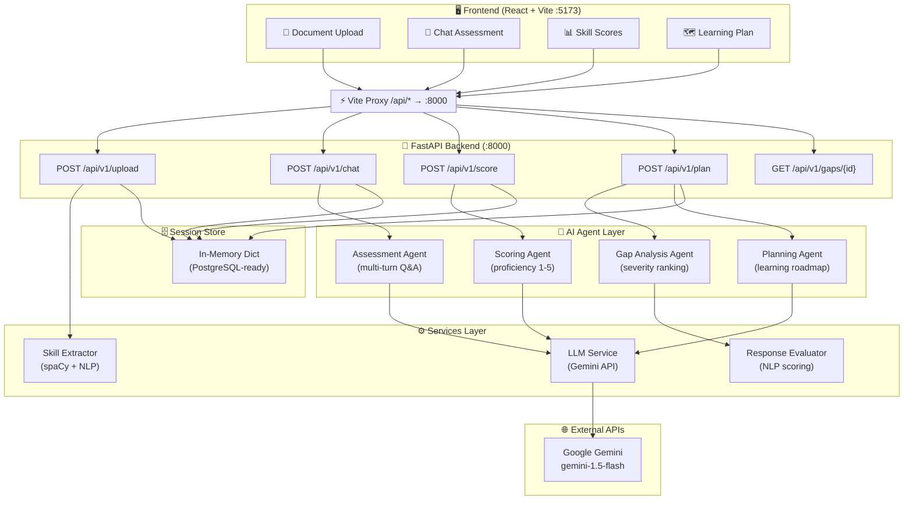
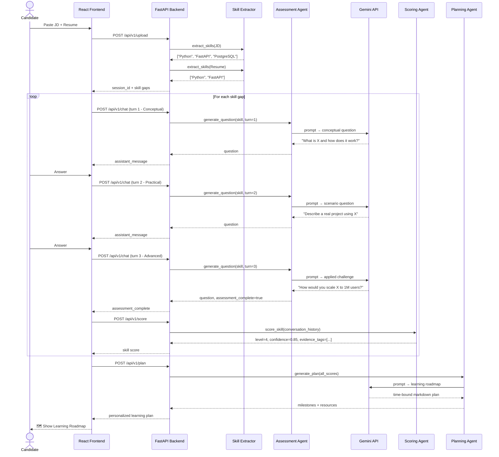
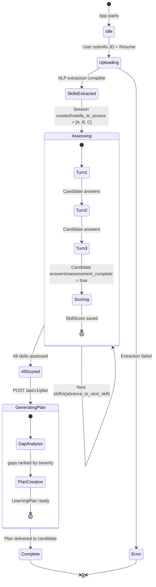
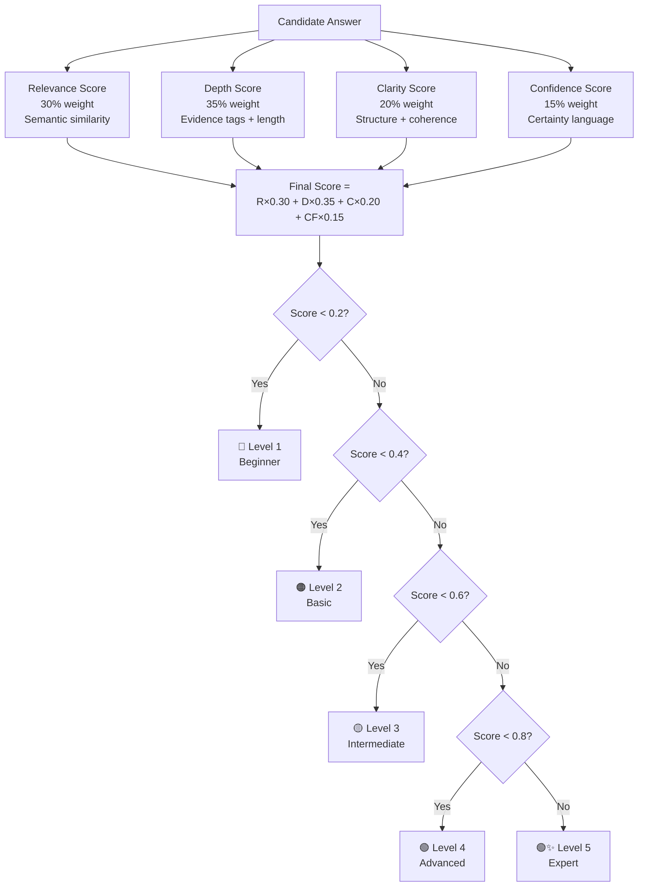

# 🧠 AI Resume Skill Assessment Agent

> **Hackathon Project** — Built by [Shivam Yadav](https://github.com/shivamyadav039)

---

## 🚀 Problem

Resumes **claim** skills but don't prove real proficiency.  
Recruiters waste hours interviewing candidates who can't actually do the work.

---

## 💡 Solution

An AI agent that bridges the gap — automatically:

- 📄 **Analyzes** the Job Description + Candidate Resume
- 🤖 **Conducts** a conversational skill assessment (like a real interview)
- 📊 **Identifies** skill gaps ranked by severity
- 🗺️ **Generates** a personalized, time-bound learning roadmap

---

## 🛠️ Tech Stack

| Layer | Technology |
|-------|-----------|
| **AI / LLM** | Google Gemini API (`gemini-1.5-flash`) |
| **Backend** | Python + FastAPI |
| **Frontend** | React + Vite (Tailwind CSS) |
| **NLP** | spaCy + sentence-transformers |
| **Session Store** | In-memory (PostgreSQL-ready) |
| **API Docs** | Swagger UI (auto-generated) |

---

## 🔥 Features

| Feature | Description |
|---------|-------------|
| ✅ Skill Extraction | Parses JD + Resume using NLP to find skill gaps |
| ✅ AI Questioning | Multi-turn adaptive interview (Conceptual → Practical → Advanced) |
| ✅ Proficiency Scoring | 1–5 level scoring with confidence % and evidence tags |
| ✅ Gap Analysis | Severity ranking (Critical / High / Medium / Low) |
| ✅ Learning Plan | Personalized roadmap with resources + time estimates |
| ✅ REST API | Full OpenAPI spec, testable via Swagger UI |
| ✅ Frontend UI | React chat interface, proxied to backend |

---

## 🏗️ System Architecture



---

## 🔄 UML Sequence Diagram — Full Assessment Flow



---

## 🧩 UML Class Diagram — Core Components

```mermaid
classDiagram
    class AssessmentAgent {
        +generate_assessment_question(skill, turn_count, history, jd, resume) str
        +extract_response_quality(user_message) float
        +should_continue_assessment(turn_count, quality, max_turns) bool
    }

    class ScoringAgent {
        +score_skill_proficiency(skill, history, jd_required_level) SkillScore
        -_calculate_proficiency_level(quality_score) int
        -_extract_evidence_tags(responses) list
    }

    class GapAnalysisAgent {
        +analyze_skill_gaps(skill_scores, jd_skills) GapAnalysis
        -_classify_severity(gap) str
        -_rank_by_priority(gaps) list
    }

    class PlanningAgent {
        +generate_learning_plan(skill_scores, jd_skills, resources, weekly_hours) LearningPlan
        -_estimate_duration(gap_level) int
        -_curate_resources(skill) list
    }

    class LLMService {
        -api_key: str
        -model: str
        -client: GenerativeModel
        +call_claude(system_prompt, user_prompt, max_tokens, temperature) str
        -_call_gemini_api(system, user, max_tokens, temp) str
        -_get_cached_response(system, user) Optional~str~
        -_cache_response(system, user, response) void
        -_get_fallback_response(prompt) str
    }

    class SkillExtractor {
        +extract_skills(text) list~str~
        -_spacy_extract(text) list
        -_keyword_match(text) list
        -_deduplicate(skills) list
    }

    class SkillScore {
        +skill: str
        +assessed_level: int
        +jd_required_level: int
        +gap: int
        +confidence: float
        +evidence_tags: list~str~
        +conversation_summary: str
    }

    class LearningPlan {
        +session_id: str
        +priority_skills: list~str~
        +adjacent_skills: list~str~
        +total_duration_weeks: int
        +milestones: list~Milestone~
        +success_metrics: dict
    }

    class GapAnalysis {
        +overall_readiness: float
        +critical_gaps: list~str~
        +high_gaps: list~str~
        +medium_gaps: list~str~
        +strengths: list~str~
    }

    AssessmentAgent --> LLMService : uses
    ScoringAgent --> LLMService : uses
    PlanningAgent --> LLMService : uses
    GapAnalysisAgent --> SkillScore : analyzes
    ScoringAgent --> SkillScore : produces
    PlanningAgent --> LearningPlan : produces
    PlanningAgent --> GapAnalysis : uses
    GapAnalysisAgent --> GapAnalysis : produces
```



---

## 🔀 Data Flow Diagram

```mermaid
flowchart LR
    JD["📋 Job Description"] --> SE["Skill Extractor\nspaCy NLP"]
    RESUME["📄 Resume"] --> SE

    SE --> SKILLS_JD["JD Skills\n[Python, FastAPI, PostgreSQL]"]
    SE --> SKILLS_CV["Resume Skills\n[Python, FastAPI]"]

    SKILLS_JD --> GAP_CALC["Gap Calculator\nJD - Resume"]
    SKILLS_CV --> GAP_CALC

    GAP_CALC --> GAPS["Skill Gaps\n[PostgreSQL ← CRITICAL]"]

    GAPS --> ASSESS["Assessment Agent\nGemini LLM"]
    ASSESS --> Q1["Turn 1: Conceptual Q"]
    ASSESS --> Q2["Turn 2: Practical Q"]
    ASSESS --> Q3["Turn 3: Applied Q"]

    Q1 --> ANS1["Candidate Answer"]
    Q2 --> ANS2["Candidate Answer"]
    Q3 --> ANS3["Candidate Answer"]

    ANS1 --> SCORER["Scoring Agent\n4-dim NLP evaluation"]
    ANS2 --> SCORER
    ANS3 --> SCORER

    SCORER --> SCORE["SkillScore\nLevel 3 | Conf 72%\nEvidence: [project, technical]"]

    SCORE --> GA["Gap Analysis Agent\nSeverity ranking"]
    GA --> RANKED["Ranked Gaps\n🔴 Critical: PostgreSQL\n🟠 High: System Design\n🟡 Medium: Docker"]

    RANKED --> PA["Planning Agent\nGemini LLM"]
    PA --> PLAN["📚 Learning Plan\nWeek 1-4: PostgreSQL\nWeek 5-8: System Design\nWeek 9-10: Docker"]
```



---

## 🔄 State Diagram — Assessment Session Lifecycle



---

## 📊 Scoring Logic — Decision Flow



---

## 🧠 How It Works

```
1. You paste a Job Description + Resume
         ↓
2. AI extracts required skills from JD
   and maps them against your resume
         ↓
3. For each skill gap, the AI asks 3 questions:
   • Turn 1 → Conceptual  ("What is X?")
   • Turn 2 → Practical   ("Describe a project using X")
   • Turn 3 → Advanced    ("How would you optimise X at scale?")
         ↓
4. Each answer is scored on 4 dimensions:
   Relevance (30%) + Depth (35%) + Clarity (20%) + Confidence (15%)
         ↓
5. A personalised learning roadmap is generated
   with curated resources, milestones & time estimates
```

---

## 🏗️ Project Structure

```
hackathon_deccan/
├── backend/                    ← FastAPI Python backend
│   ├── app/
│   │   ├── main.py             ← All API endpoints
│   │   ├── config.py           ← Settings (reads .env)
│   │   ├── agents/             ← AI agent implementations
│   │   │   ├── assessment_agent.py
│   │   │   ├── scoring_agent.py
│   │   │   ├── gap_analysis_agent.py
│   │   │   └── planning_agent.py
│   │   └── services/
│   │       ├── llm_service.py  ← Gemini API wrapper
│   │       └── skill_extractor.py
│   ├── requirements.txt
│   └── .env.example
│
├── frontend/                   ← React + Vite UI
│   ├── src/
│   │   ├── App.jsx
│   │   └── components/
│   ├── vite.config.js          ← Proxies /api → backend:8000
│   └── package.json
│
└── README.md                   ← You are here
```

---

## ⚙️ Setup & Run

### Prerequisites
- Python 3.10+
- Node.js 18+
- A [Gemini API Key](https://aistudio.google.com/app/apikey) (free)

---

### 1. Clone the repo
```bash
git clone https://github.com/shivamyadav039/AI-Skill-Assessment.git
cd AI-Skill-Assessment
```

### 2. Backend Setup
```bash
cd backend

# Create virtual environment
python -m venv venv
source venv/bin/activate        # macOS/Linux
# venv\Scripts\activate         # Windows

# Install dependencies
pip install -r requirements.txt

# Configure environment
cp .env.example .env
# → Open .env and add your GEMINI_API_KEY

# Start backend server
uvicorn app.main:app --reload --host 0.0.0.0 --port 8000
```

Backend live at: **http://localhost:8000**  
API Docs at: **http://localhost:8000/docs**

---

### 3. Frontend Setup
```bash
cd frontend

# Install dependencies
npm install

# Start frontend dev server
npm run dev
```

Frontend live at: **http://localhost:5173**

> ✅ Vite automatically proxies `/api/*` calls to the backend — no CORS issues.

---

## 🔑 API Key Setup

1. Go to [aistudio.google.com/app/apikey](https://aistudio.google.com/app/apikey)
2. Create a free API key
3. Open `backend/.env` and set:

```env
GEMINI_API_KEY=AIza-your-key-here
MODEL_NAME=gemini-1.5-flash
```

---

## 🔌 API Quick Reference

### Upload Documents
```bash
curl -X POST http://localhost:8000/api/v1/upload \
  -H "Content-Type: application/json" \
  -d '{
    "candidate_name": "Shivam Yadav",
    "jd_content": "We need a Python developer with FastAPI and PostgreSQL.",
    "resume_content": "3 years Python, FastAPI experience."
  }'
```

### Chat Assessment
```bash
curl -X POST http://localhost:8000/api/v1/chat \
  -H "Content-Type: application/json" \
  -d '{
    "session_id": "session_72558d311b71",
    "skill": "Python",
    "user_message": "I have 3 years of Python experience in production.",
    "turn_count": 1
  }'
```

### Generate Learning Plan
```bash
curl -X POST http://localhost:8000/api/v1/plan \
  -H "Content-Type: application/json" \
  -d '{"session_id": "session_72558d311b71"}'
```

---

## 🔍 Verify Frontend + Backend Are Connected

```bash
# 1. Backend health check
curl http://localhost:8000/health

# 2. Test via frontend proxy (confirms connection)
curl -X POST http://localhost:5173/api/v1/upload \
  -H "Content-Type: application/json" \
  -d '{"candidate_name":"Test","jd_content":"Python FastAPI","resume_content":"Python 3 years"}'
```

Both should return JSON ✅

---

## 📌 Future Improvements

- 🎙️ **Voice-based interview** — speak your answers instead of typing
- 📊 **Real-time scoring dashboard** — live confidence graphs during interview
- 🔗 **LinkedIn / GitHub integration** — auto-fetch resume from profile
- 🗄️ **PostgreSQL persistence** — store sessions, history, and reports
- 📧 **Email report** — send the learning plan as a PDF

---

## 👨‍💻 Author

**Shivam Yadav**  
GitHub: [@shivamyadav039](https://github.com/shivamyadav039)

---

## 📄 License

MIT License — feel free to use, fork and build on this!
